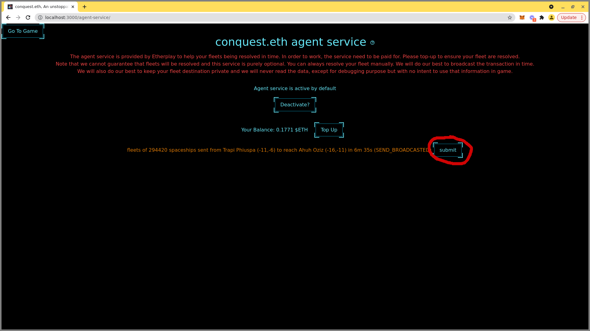

# Agent Service

As mentioned in [Send your first fleet](send-your-first-fleet.md) sending fleets require 2 transactions. One will make your fleet leaves its origin planet. And the second need to be performed when the fleet reaches its destination.


Note that when you fleet leave your planet, it is possible that it leaves just before an attacking fleet reaches your planet. If the time difference is small enough, the attacking fleet will attack your departing fleet.

This is to prevent a kind of "front-running" strategy that would allow you to see the pending attack transaction (the transaction queue is public) and escape with your fleet.


While you can definitely come back to the game to perform the 2nd transaction, it is possible that the time is not suitable for you. We provide thus a service that will resolve the 2nd transaction for you.&#x20;


In conquest.eth your fleets destination are unknown to anyone but you. Our new service (version 2025.1 onward) keep that secret, even from us. You still trust us to perform the transaction on your behalf but we do not know the destination of your fleet until reveal time.

We of course intend to do our best to perform the reveal transaction in time, but things can always go wrong and you might want to come back to check it for yourself. There is 12h window to reveal so that gives you some time to ensure your fleet as arrived. Of course, ideally you want your fleet to arrive at the planned time for macimum efficiency.



In pas version, you had to go through a registration and top-up process, this is not required anymore. You pay for the service when you send your fleet. THis make a much better user experience.


In term of gas pricing, the default client is using a worst case scenario set by us and we cover the case the gas price go above that limit. As such you should be fine.


It is also possible to submit fleets to the agent-service after they have been sent. But this need to be done before the fleet reaches destination.

