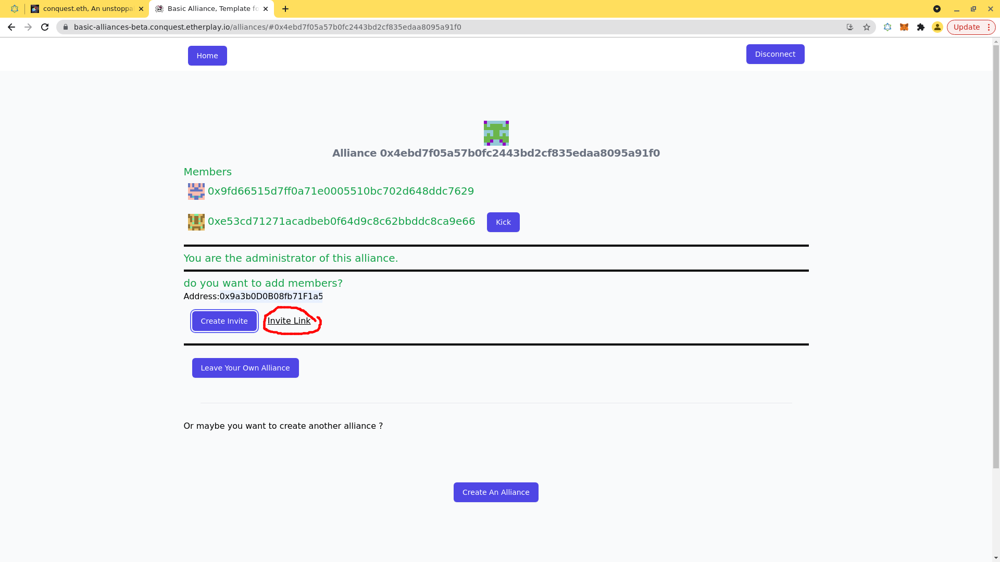

# Alliances

## Introduction

Conquest is a first and foremost a social game.

For multiple reasons:

- the fact that you can see everyone planets&#x20;
- That your power is related to your stake and that by collaborating you can escape that equation and instead increase your overall power while keeping your risk same.&#x20;
- And unless you have allies, you ll have to assume everyone is your enemies and attacking anyone of them will expose you to others

As such your best bet is to quickly identify your potential allies and make some arangement.

Conquest add the concept of alliances make it even easier for you to collaborate.

With an alliance, you can send spaceships to your allies without cost and you can feel confident that attacking the same enemy planet will not result in each of you attacking each other.

Conquest's alliances are smart contract and so you can customize as you like them. For the alpha we provide one basic type: the "Basic Alliance" which has one admin in charge&#x20;

## The Basic Alliance

While we encourage players to create their own smart contract (contact us if you want to do it!), we provided a basic alliance smart contract for you to enjoy.

We open-sourced the basic-alliance smart contract and website here: [https://github.com/wighawag/conquest-basic-alliance](https://github.com/wighawag/conquest-basic-alliance)

We are also hosting it here : [https://2025-1.conquest.game/basic-alliances/](https://2025-1.conquest.game/basic-alliances/)

If you want to create your own alliance system, you can also have your own website to manage it the way you like, without the need for any change in conquest itself. It is fully composable

If you just want to create a quick alliance, follow along:

Go to [https://2025-1.conquest.game/basic-alliances/](https://2025-1.conquest.game/basic-alliances/)

Click "Create a new Alliance" to create a new alliance

You ll be asked to sign a message so your account can also be a member.

Then you'll be asked to perform a tx

Once the tx is confirmed, you ll be both member and administrator of your newly created alliance

In the picture below, the account has already another member

You can always add more member by clicking "Create Invite"

But before you ll need to specify the address of the player you want to add:

Once the signature goes through, you 'll get an "invite Link" that you can share with the player you want to add as member (Assuming it control that same address you used above)

If you navigate to that link with a different address, that is what you'll see:

Otherwise, they'll get a button "Join" to click

This will trigger a message signing request as well as a transaction to actually join the alliance.&#x20;

The current UI do not show progress so feel free to follow along the tx on the block explorer and reload the page. This can take a minute or so.

### Advantage given to public alliance's member

Once players are in the same alliance, they can send spaceships to each other without any penalties (for non-allies, it is 20%)

Alliances members also do not run the risk of attacking each other if their fleet end up against the same enemy.

Furthermore, as alluded above, allies can combine spaceships from different planet without the need for an intermediary planet. They just need to send spaceships to arrive at the same time on the destination planet.
